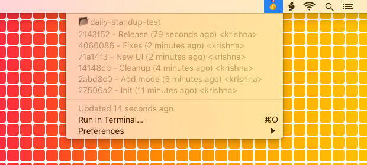
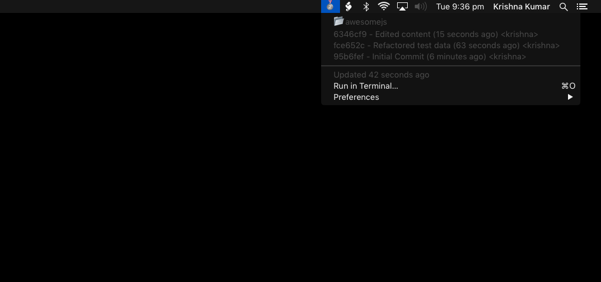
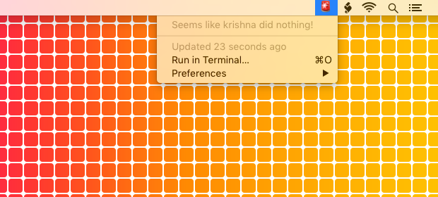
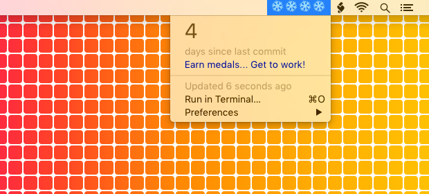

# Daily Standup - BitBar Plugin

Bitbar is a Mac OS X menu bar utilty - https://getbitbar.com/

## 🥇 Gold medal - 5+ commits


## 🥈 Silver medal - 3 commits


## 🥉 Bronze medal - 1 commit


## 🚨 No commits for more than 7 days


## ❄️ 4 days since last commit


## IMPORTANT
 For the plugin to work properly, you need to provide a PROJECTS_DIRECTORY where you typically store all your git repos.

 For example -

```
 PROJECTS_DIRECTORY = /Users/krishna/projects
```
Change this according to your setup.

## DEPENDENCIES

You need to have git-standup installed.

To install git-standup on OSX with homebrew, open Terminal and run -

```
$ brew install git-standup
```

For other installation options, see this page - https://github.com/kamranahmedse/git-standup
