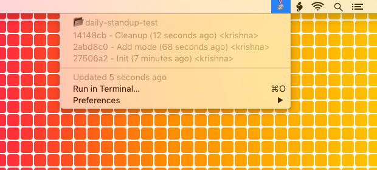

# Daily Standup - BitBar Plugin

Bitbar is a Mac OS X menu bar utilty - https://getbitbar.com/

## 🥇 Gold medal - 5 commits today


## 🥈 Silver medal - 3 commits today


## 🥉 Bronze medal - 1 commit today


## 🚨 No commits for more than 7 days


## ❄️ 4 days since last commit


## IMPORTANT
 For the plugin to work properly, you need to provide a PROJECTS_DIRECTORY where you typically store all your git repos.

 For example -

 ```PROJECTS_DIRECTORY = /Users/krishna/projects```

Change this according to your setup.
